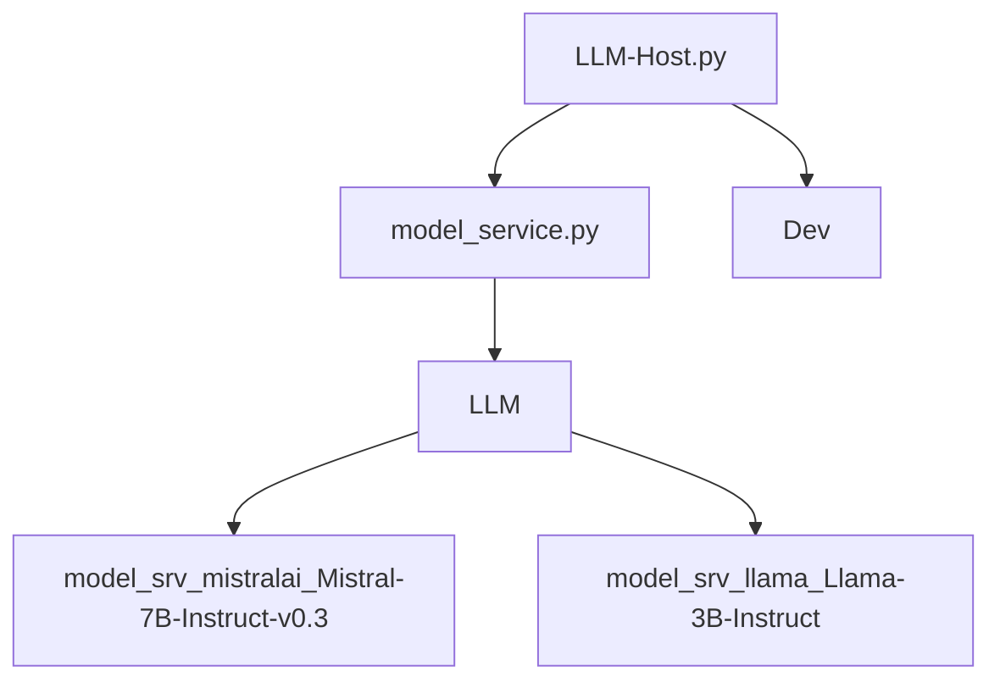
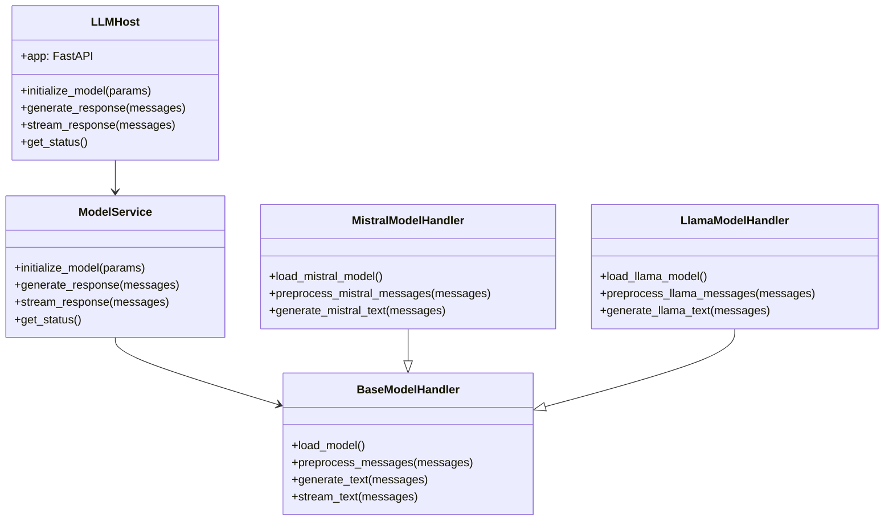
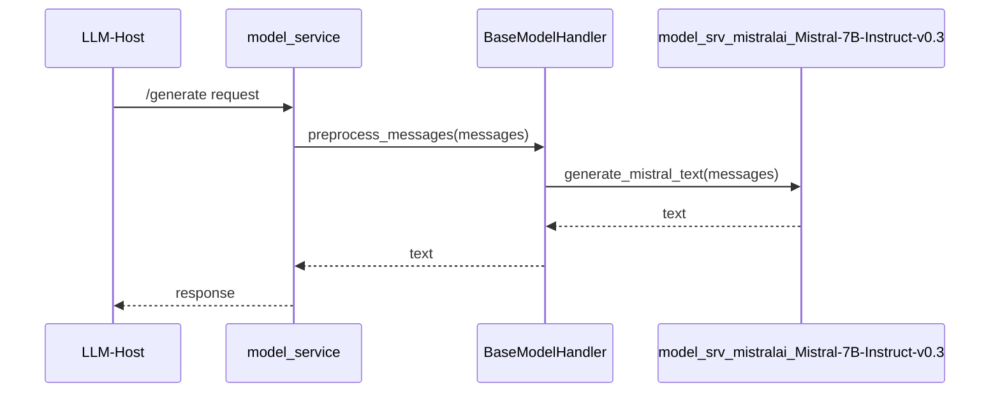
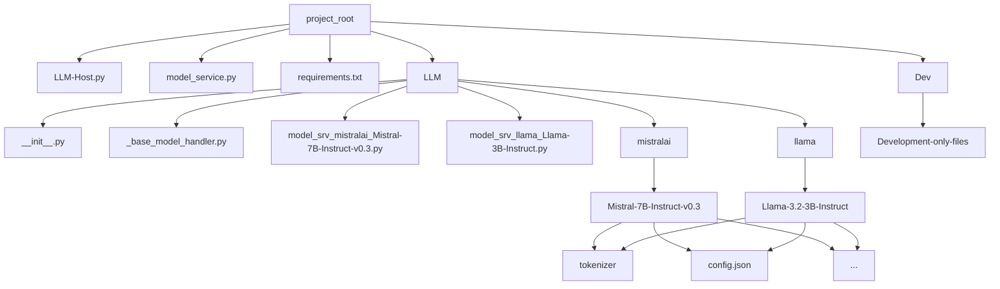

# To Run: 
* Make sure the CUDA tools and driver are installed
  * Only currently tested with CUDA 12.6/12.7 on RTX4070ti GPU in WSL Ubuntu 24.04lts

## To run locally:
1. Build the venv & install the python requirements:
> ./Scripts/RebuildVenvLx.sh
2. Run the app:
> uvicorn LLM-Host:app --host 0.0.0.0 --port 41443 --reload

## To run in Docker:
*Currently this often builds a **very** large image as-is, because it installs all locally downloaded LLM models and quantization occurs at runtime... just know that, without tweaking your dockerfile, this will make a large image and container, it also will take a large amount of time to do so. Test first locally, make sure everything runs great and that you don't want to change anything, then give it a go. Caveat emptor*.
1. Build the Docker image:
> docker build -t [[IMAGENAME]] .
2. Run the Docker container:
> docker run -it --rm --gpus all -p 41443:41443 [[IMAGENAME]]

# To add a new model:
1. Add a new handler file in the LLM/ directory
2. Add the model to the LLM/ directory with the standard Huggingface {vendor}/{model}/* format (currently only Transformers-type models are supported)

# Layout
* LLM-Host.py - The FastAPI app
* model_service.py - The model service that loads the model handler
* LLM/ - All model-specific code, the model handlers, and the models themselves
* LLM/_base_model_handler.py - The base class for all model handlers
* LLM/model_srv_{model_name}.py - The model-specific handler

## Directory Structure
```
project_root/
│
├── LLM-Host.py
├── model_service.py
├── requirements.txt (not yet active #ToDo – pull from InstallPyReqs.sh)
├── readme.md: The primary documentation file for setting up, running, and contributing to the service
├── dockerfile: The Dockerfile for building the Docker image
│
├── Scripts/
│   ├── RebuildVenvLx.sh: The script for rebuilding the Python virtual environment
│   ├── RebuildVenvWin.sh: The script for rebuilding the Python virtual environment (not yet functional due to CUDA issues)
│   ├── InstallPyReqs.sh: The script for installing the required Python packages into the virtual environment.
│   ├── VenvLx_Activate.sh: The activation command for starting the Linux virtual environment
│   ├── VenvWin_Activate.bat: The activation command for starting the Windows virtual environment (not yet functional due to CUDA issues)
│   │
│   └── PyReqs/
│       └── ... (The scripts for installing the required Python packages into the virtual environment based on the specific model to be used)
│
├── LLM/
│   ├── __init__.py
│   ├── _base_model_handler.py
│   ├── model_srv_mistralai_mistral_7b_instruct_v0_3.py
│   ├── model_srv_meta_llama_llama_3_2_3b_instruct.py
│   ├── ... (additional model handler files)
│   │
│   ├── mistralai/
│   │   ├── Mistral-7B-Instruct-v0.3/
│   │   │   ├── tokenizer/
│   │   │   ├── config.json
│   │   │   └── ... (model files)
│   │   │
│   │   └── ... (additional mistalai models)
│   │
│   ├── meta-llama/
│   │   ├── Llama-3.2-3B-Instruct/
│   │   │   ├── tokenizer/
│   │   │   ├── config.json
│   │   │   └── ... (model files)
│   │   │
│   │   └── ... (additional meta-llama models)
│   │
│   └── ... (additional model directories)
│
└── Dev/
    └── Development-only-files
```
## Consists of four key pieces:
* LLM-Host.py:
  * Contains the FastAPI application, route definitions, and minimal “controller” logic.
  * Delegates all model handling to a new “service” layer.
* model_service.py:
  * Coordinates the loading of different model handlers based on the requested model name.
  * Maintains references to whichever model is currently loaded.
  * Provides shared logic and bridging between the FastAPI endpoints and the specific model implementations.
* LLM/_base_model_handler.py:
  * Defines a base handler class (BaseModelHandler) that sets out the interface for loading a model, preprocessing messages, applying templates, generating text, streaming, etc.
  * Common logic can live here.
* LLM/model_srv_{model_name}.py:
  * A model-specific file with a subclass of BaseModelHandler.
  * Contains only the model-specific code, templates, message preprocessing, tokenization quirks, etc.
  * Each model contains its own handler file, and it in-turn points to the model files

### Systems Architecture Diagram

### Component Relationships Diagram

### Request Flow Diagram

### Package Structure Diagram

### v1 Endpoint & Model Service Flow Diagram
```
                   ┌────────────────────────────┐
                   │       LLM-Host.py          │
                   │----------------------------│
(1)  FastAPI(...) -> + app = FastAPI(...)       │
                   │                            │
     + POST /v1/chat/completions                │
                   │ │                          │
                   │ ├─POST(Streaming=False)──► calls ──► model_service.generate_response(messages)
                   │ │         │                │
                   │ │         ╞═(If needed)──► calls ──► model_service.initialize_model(params)
                   │ │         │                │
                   │ └─POST(Streaming=True)───► calls ──► model_service.stream_response(messages)
                   │                            │
     + POST /v1/completions                     │
                   │                            │
                   │                            │
     + POST /v1/embeddings                      │
                   │                            │
                   │                            │
     + GET /v1/models                           │
                   │                            │
                   │                            │
     + Additional placeholders (/v1/audio, /v1/files, /v1/fine-tuning, etc.)
                   │                            │
                   │                            │
                   └────────────────────────────┘
                                 ▲
                                 │
                                 │
   ┌─────────────────────────────────────────────────────────────┐
   │                    model_service.py                         │
   │-------------------------------------------------------------│
   │  Global or class-based structure (e.g. ModelService class)  │
   │-------------------------------------------------------------│
   │    + model, tokenizer, model_params, etc.                   │
   │    + def initialize_model(params):                          │
   │        - loads the correct model, checks quant config, etc. │
   │        - sets chat_template or special transforms           │
   │                                                             │
   │    + def generate_response(messages):                       │
   │        - handle model-specific role transformations       │
   │        - apply chat template                                │
   │        - call model.generate(...)                           │
   │        - return text                                        │
   │                                                             │
   │    + def stream_response(messages):                         │
   │        - streaming version of above logic                   │
   │        - uses streamer & yields tokens                      │
   │                                                             │
   │    + def get_status():                                      │
   │        - returns whether model is loaded, which model, etc. │
   └─────────────────────────────────────────────────────────────┘
```
### High-Level Project Structure Diagram
```
┌────────────────────────────┐         ┌─────────────────────────────┐
│       LLM-Host.py          │         │        model_service.py     │
│----------------------------│         │-----------------------------│
│ - FastAPI app definition   │         │ - Shared utilities          │
│ - Endpoint definitions     │         │ - Model registry            │
│ - Delegates requests to    │◄───────►│ - Common processing logic   │
│   appropriate model handler│         └─────────────────────────────┘
└────────────────────────────┘                      ▲
                                                    │
                                                    │
                       ┌────────────────────────────┴─────────────────────────────┐
                       │                LLM/_base_model_handler.py                │
                       │----------------------------------------------------------│
                       │ - Generic loading and inference logic                    │
                       │ - Extended by specific models' requirements as needed    │
                       │   ┌──────────────────────────────────────────────────┐   │
                       │   │ model_srv_mistralai_Mistral-7B-Instruct-v0.3.xxx │   │
                       │   │--------------------------------------------------│   │
                       │   │ - Model-specific configurations                  │   │
                       │   │ - Override methods for preprocessing             │   │
                       │   │ - Override methods for postprocessing            │   │
                       │   │ - Define chat templates                          │   │
                       │   └──────────────────────────────────────────────────┘   │
                       │                                                          │
                       │   ┌───────────────────────────────────────────────┐      │
                       │   │ model_srv_llama_Llama-3.2-3B-Instruct.xxx     │      │
                       │   │-----------------------------------------------│      │
                       │   │ - Model-specific configurations               │      │
                       │   │ - Override methods for preprocessing          │      │
                       │   │ - Override methods for postprocessing         │      │
                       │   │ - Define chat templates                       │      │
                       │   └───────────────────────────────────────────────┘      │
                       │                                                          │
                       │   ... (additional model files) ...                       │
                       └──────────────────────────────────────────────────────────┘

```

## Detailed Project Structure
The project is divided into distinct layers and files to ensure clear separation of concerns:

1. LLM-Host.py (FastAPI app):
   • Defines all the HTTP endpoints.
   • Connects FastAPI routes to the appropriate model service functions.

2. model_service.py (Model Service):
   • Dynamically loads and manages model handlers based on user requests.
   • Maintains reference to the currently loaded model/parameters.
   • Offers methods for generating text and streaming tokens.

3. LLM/_base_model_handler.py: The base class that includes the generic loading and inference logic. Subclasses override or extend as needed.

4. LLM/model_srv_{model_name}.py: Model-specific handling. Provides unique chat prompts, tokenization quirks, or special logic required for that particular family of models.

## File Roles and Scopes
* LLM-Host.py: Main FastAPI server application. Defines routes for both “old” and “v1” endpoints, and handles requests/responses.
* model_service.py: Encapsulates model initialization, generation, streaming, and retrieval of model status.
* LLM/_base_model_handler.py: The base class that includes the generic loading and inference logic. Subclasses override or extend as needed.
* LLM/model_srv_{model_name}.py: Model-specific handling. Provides unique chat prompts, tokenization quirks, or special logic required for that particular family of models. Each model has its own file, but multiple files with different specific configurations can be created for the same model.
* readme.md: The primary documentation file for setting up, running, and contributing to the service.
* dockerfile: The Dockerfile for building the Docker image.
* Scripts/RebuildVenvLx.sh: The script for rebuilding the Python virtual environment.
* Scripts/RebuildVenvWin.sh: The script for rebuilding the Python virtual environment. (not yet functional due to CUDA issues)
* Scripts/InstallPyReqs.sh: The script for installing the required Python packages into the virtual environment.
* Scripts/PyReqs/*: The scripts for installing the required Python packages into the virtual environment based on the specific model to be used.
* Scripts/VenvLx_Activate.sh: The activation command for starting the Linux virtual environment
* Scripts/VenvWin_Activate.bat: The activation command for starting the Windows virtual environment (not yet functional due to CUDA issues)

## Extended File Role & Scope Guidance
Here is a more detailed view of how each file interacts and when you might add or modify code:

• LLM-Host.py (Endpoints & Routing):
  - Houses only minimal controller logic and the FastAPI route definitions.
  - If you need to create or change how the API is accessed (e.g., new endpoints or versions), do so here.
  - Keep model/business logic outside of this file to maintain a clean separation of concerns.

• model_service.py (Orchestration Logic):
  - Serves as the gateway between the HTTP routes (LLM-Host.py) and the model handlers (in LLM/).
  - If new features are needed that apply to multiple models (e.g., multi-model dispatch), extend this service.
  - Avoid model-specific code here. Instead, rely on model-specific handlers under LLM/.

• LLM/_base_model_handler.py (Shared Model Handling):
  - Contains generic functionality for loading, tokenizing, generating, and streaming outputs from any model.
  - If you need to modify or add logic that benefits all or most models (e.g., generic streaming improvements), update it here.
  - Do not embed logic unique to a single model. Place that in a model-specific file.

• LLM/model_srv_{model_name}.py (Model-Specific Handlers):
  - Each model gets its own file, named according to a uniform “model_srv_...” pattern.
  - Override or extend _base_model_handler.py methods for specialized tokenization or advanced chat prompts.
  - Keep code strictly related to that model’s specifics in this file. For instance, Mistral vs. Llama might have different role definitions or templates.

• readme.md (Documentation & Guidance):
  - Explains how each part of the system works together.
  - Use this file to clarify the intended locations of new logic, ensuring future maintainers quickly find the right place for their work.

## Explanation of All Current API Endpoints

### v1 Endpoints (OpenAI-Compatible Style, In Progress)
1. POST /v1/chat/completions  
   Accepts a JSON body with messages in OpenAI-style format and returns chat completions. This endpoint can be extended to stream responses.

2. POST /v1/completions  
   Processes traditional single-prompt completions (similar to OpenAI’s /completions).

3. POST /v1/embeddings  
   Generates embeddings (vector representations) based on user input.

4. GET /v1/models  
   Returns a list of available models that can be used with this microservice.

5. Additional placeholders (/v1/audio, /v1/files, /v1/fine-tuning, etc.)  
   These endpoints are currently not implemented but are reserved for future expansion, matching OpenAI endpoints.

### Old Endpoints (Deprecated / For Reference)
1. POST /old/initialize  
   Initializes the model with the provided parameters.

2. POST /old/generate  
   Generates a response from the current model using the provided messages.

3. POST /old/stream  
   Streams token-by-token responses from the model.

4. GET /old/status  
   Returns status information about the currently loaded model.

### Old Endpoints to Model Service Flow Diagram
```
                   ┌────────────────────────────┐
                   │       LLM-Host.py          │
                   │----------------------------│
(1)  FastAPI(...) -> + app = FastAPI(...)       │
                   │                            │
     + /initialize ---- calls --> model_service.initialize_model(params)
                   │                            │
     + /generate   ---- calls --> model_service.generate_response(messages)
                   │                            │
     + /stream     ---- calls --> model_service.stream_response(messages)
                   │                            │
     + /status     ---- calls --> model_service.get_status()
                   └────────────────────────────┘
                                 ▲
                                 │
                                 │
   ┌─────────────────────────────────────────────────────────────┐
   │                    model_service.py                         │
   │-------------------------------------------------------------│
   │                                                             │
   ~~~~~~~~~~~~~~~~~~~~~~~~~~~~~~~~~~~~~~~~~~~~~~~~~~~~~~~~~~~~~~~
```
